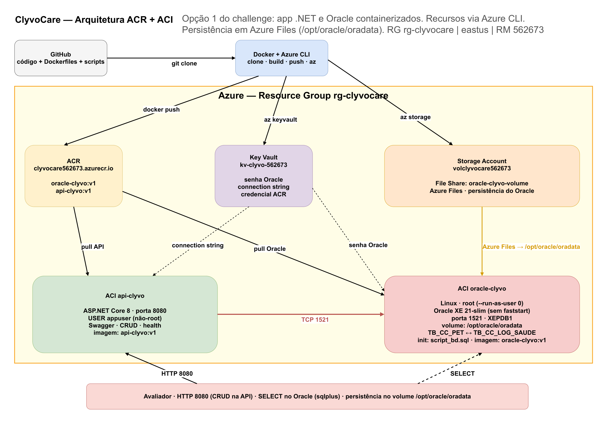

# ClyvoCare — Sprint 3 DevOps (ACR + ACI)

**Integrantes**

- Geovanne Coneglian Passos — RM 562673
- Lucas Silva Gastão Pinheiro — RM 563960
- Guilherme Soares De Almeida — RM 563143

---

## 1. Descrição da solução

O **ClyvoCare** recebe leituras biométricas de pets (peso, temperatura e batimentos) de dispositivos IoT, associa cada animal ao tutor responsável e grava o histórico clínico.

| Tabela | Papel |
| --- | --- |
| `TB_CC_PET` | Animal monitorado (CORE) |
| `TB_CC_LOG_SAUDE` | Leitura de saúde do pet (CORE) |
| `TB_CC_USUARIO` | Tutor responsável pelo animal |

CRUD completo (incluir, alterar, excluir, consultar) em **Pet** e **Log de Saúde**, ligados por `ID_PET`.

## 2. Benefícios para o negócio

- Histórico contínuo de sinais vitais, sem depender só da consulta presencial.
- Temperatura fora de 30–45 °C é rejeitada na API, evitando lixo para modelo preditivo.
- Persistência na nuvem: Azure Files montado em `/opt/oracle/oradata`. O `SELECT` prova o que a API gravou; o volume mantém os dados se o ACI reiniciar.
- Mesma imagem no ACR e no ACI.
- Segredos no Key Vault, não no código da API.

## 3. Arquitetura



**Como funciona**

1. Azure CLI cria o Resource Group `rg-clyvocare`, o ACR `clyvocare562673`, a Storage Account `volclyvocare562673` (File Share `oracle-clyvo-volume`) e o Key Vault `kv-clyvo-562673`.
2. `docker build` gera `oracle-clyvo` (Oracle XE `21-slim`, sem `faststart`, + `script_bd.sql`) e `api-clyvo` (API .NET, usuário `appuser`, sem root).
3. `docker tag` + `docker push` enviam as imagens ao ACR.
4. ACI `oracle-clyvo` puxa a imagem do ACR, sobe Linux como root, monta o Azure Files em `/opt/oracle/oradata` e abre a porta 1521 (PDB `XEPDB1`).
5. ACI `api-clyvo` puxa a imagem do ACR, recebe a connection string do Key Vault (FQDN público do Oracle) e sobe na porta 8080 **sem** root.
6. A API responde em `http://<fqdn-api>:8080`, grava em `TB_CC_PET` e `TB_CC_LOG_SAUDE`. O dado fica no volume `/opt/oracle/oradata`; o `SELECT` no Oracle confirma.

---

## 4. How To — execução

Abra o **Git Bash** (menu Iniciar → Git Bash). Não use o PowerShell: os arquivos `.sh` não rodam nele.

Precisa ter instalado: [Git](https://git-scm.com/download/win), [Azure CLI](https://learn.microsoft.com/cli/azure/install-azure-cli-windows) (`az`) e, a partir do passo 4.5, o [Docker Desktop](https://www.docker.com/products/docker-desktop/) aberto (ícone da baleia, motor rodando).

Cole os comandos na ordem, um bloco de cada vez. Depois do clone, todos os `./scripts/...` são na pasta `clyvocare`.

### 4.1 Clone

```bash
git clone https://github.com/GuuiSOares/clyvocare.git
cd clyvocare
ls
```

Tem que aparecer `ChallengeNET-main`, `docker`, `docs`, `scripts`, `script_bd.sql` e `README.md`.

### 4.2 Login na Azure

No mesmo Git Bash:

```bash
az login
az account show
```

O `az login` abre o navegador. Entre com a conta da Azure da disciplina e volte no Git Bash.

### 4.3 Permissão dos scripts

```bash
chmod +x scripts/*.sh
```

### 4.4 Criar recursos na Azure (CLI)

Ainda no Git Bash, na pasta `clyvocare`:

```bash
./scripts/00_resource-group.sh
./scripts/01_acr.sh
./scripts/02_store-account.sh
./scripts/03_key-vault.sh
```

Cada linha sobe um recurso (Resource Group, ACR, Storage Account + File Share, Key Vault). Espere uma terminar para rodar a próxima.

### 4.5 Build, tag, push e run

Este passo é na **sua máquina**, no Git Bash, com o **Docker Desktop já aberto**.

1. Abra o Docker Desktop e espere o motor iniciar.
2. Confira se o Git Bash ainda está em `clyvocare` (`pwd`).
3. Rode **este comando** e espere terminar (o Oracle demora vários minutos):

```bash
./scripts/04_build-push.sh
```

Esse script já faz o `docker build`, o `docker tag` e o `docker push` para o ACR. **Não precisa colar o bloco abaixo.** Ele está aqui só para mostrar o que o script executa:

```bash
docker build -f docker/Dockerfile.oracle -t oracle-clyvo .
docker build -f docker/Dockerfile -t api-clyvo .
az acr login --name clyvocare562673
docker tag oracle-clyvo clyvocare562673.azurecr.io/oracle-clyvo:v1
docker tag api-clyvo clyvocare562673.azurecr.io/api-clyvo:v1
docker push clyvocare562673.azurecr.io/oracle-clyvo:v1
docker push clyvocare562673.azurecr.io/api-clyvo:v1
az acr repository list --name clyvocare562673 --output table
```

Quando o script `04` acabar, suba as imagens **localmente** com `docker run` (ainda no Git Bash):

```bash
docker volume create oracle-clyvo-data

docker run -d --name oracle-clyvo -p 1521:1521 \
  --user 0 \
  -v oracle-clyvo-data:/opt/oracle/oradata \
  -e ORACLE_PASSWORD=ClyvoOra2026 \
  -e APP_USER=clyvocare \
  -e APP_USER_PASSWORD=ClyvoApp2026 \
  oracle-clyvo

docker run -d --name api-clyvo -p 8080:8080 \
  -e ConnectionStrings__DefaultConnection="User Id=clyvocare;Password=ClyvoApp2026;Data Source=//host.docker.internal:1521/XEPDB1;" \
  api-clyvo
```

Isso é o teste na sua máquina. O Oracle local também demora a ficar pronto. O deploy na Azure (ACI) é o passo 4.6; para não duplicar container com o mesmo nome, pare o local antes de seguir:

```bash
docker stop api-clyvo oracle-clyvo
docker rm api-clyvo oracle-clyvo
```

### 4.6 Subir Oracle e API na ACI

Ainda no Git Bash, na pasta `clyvocare`. Primeiro o banco:

```bash
./scripts/05_aci-oracle.sh
```

O script recria o ACI Linux como root, monta o File Share em `/opt/oracle/oradata` e espera um pouco. Sem `faststart` a primeira subida demora vários minutos (criação do banco no volume). Se ainda não aparecer `DATABASE IS READY TO USE`, rode de novo até aparecer:

```bash
az container logs --resource-group rg-clyvocare --name oracle-clyvo
```

Só depois disso a API:

```bash
./scripts/06_aci-api.sh
```

Guarde o FQDN que o script imprime. Se precisar de novo:

```bash
fqdndotnet=$(az container show --resource-group rg-clyvocare --name api-clyvo --query ipAddress.fqdn --output tsv)
echo $fqdndotnet
```

No navegador (troque `$fqdndotnet` pelo valor do `echo`):

- Swagger: `http://$fqdndotnet:8080/swagger`
- Live: `http://$fqdndotnet:8080/health/live`
- Ready: `http://$fqdndotnet:8080/health/ready`

### 4.7 CRUD + SELECT no Oracle

Os `curl` são no Git Bash. O `SELECT` é dentro do sqlplus (depois do `az container exec`). Para sair do sqlplus: `EXIT`.

**Consulta**

```bash
curl -X GET http://$fqdndotnet:8080/api/Pets
curl -X GET http://$fqdndotnet:8080/api/LogsSaude
```

```bash
az container exec --resource-group rg-clyvocare --name oracle-clyvo --exec-command "sqlplus clyvocare/ClyvoApp2026@//localhost/XEPDB1"
```

Espere aparecer `SQL>`. Só então cola o `SELECT`. Sem o `SQL>`, ainda não entrou (ou o comando ainda está abrindo).

```sql
SELECT * FROM TB_CC_PET;
SELECT * FROM TB_CC_LOG_SAUDE;
```

`EXIT` e volte ao Git Bash. Depois de cada POST/PUT/DELETE abaixo, entre de novo no sqlplus e rode os dois `SELECT`.

**Inserção**

```bash
curl -X POST http://$fqdndotnet:8080/api/Pets \
  -H "Content-Type: application/json" \
  -d '{"nome":"Bidu","especie":"Cachorro","dataNascimento":"2023-01-10","usuarioId":1}'

curl -X POST http://$fqdndotnet:8080/api/LogsSaude \
  -H "Content-Type: application/json" \
  -d '{"peso":12.50,"temperatura":38.60,"batimentosCardiacos":110,"observacoes":"Coleta IoT em repouso.","petId":1}'
```

```sql
SELECT * FROM TB_CC_PET;
SELECT * FROM TB_CC_LOG_SAUDE;
```

**Alteração**

```bash
curl -X PUT http://$fqdndotnet:8080/api/Pets/1 \
  -H "Content-Type: application/json" \
  -d '{"id":1,"nome":"Thor Atualizado","especie":"Cachorro","dataNascimento":"2022-04-15","usuarioId":1}'

curl -X PUT http://$fqdndotnet:8080/api/LogsSaude/1 \
  -H "Content-Type: application/json" \
  -d '{"peso":29.10,"temperatura":39.20,"batimentosCardiacos":118,"observacoes":"Febre leve detectada pelo sensor.","petId":1}'
```

```sql
SELECT * FROM TB_CC_PET;
SELECT * FROM TB_CC_LOG_SAUDE;
```

**Exclusão**

```bash
curl -X DELETE http://$fqdndotnet:8080/api/LogsSaude/3
curl -X DELETE http://$fqdndotnet:8080/api/Pets/3
```

```sql
SELECT * FROM TB_CC_PET;
SELECT * FROM TB_CC_LOG_SAUDE;
```

**Persistência no volume**

Os `SELECT` acima mostram o dado no Oracle. Para provar que está no Azure Files (`/opt/oracle/oradata`) e não só na memória do container:

```bash
az container restart --resource-group rg-clyvocare --name oracle-clyvo
```

Espere o banco voltar (`DATABASE IS READY TO USE` nos logs), entre de novo no sqlplus e rode os dois `SELECT`. As linhas continuam lá.

### 4.8 Logs dos containers

```bash
az container logs --resource-group rg-clyvocare --name oracle-clyvo
az container logs --resource-group rg-clyvocare --name api-clyvo
```

### 4.9 Encerrar recursos

```bash
./scripts/99_cleanup.sh
```
